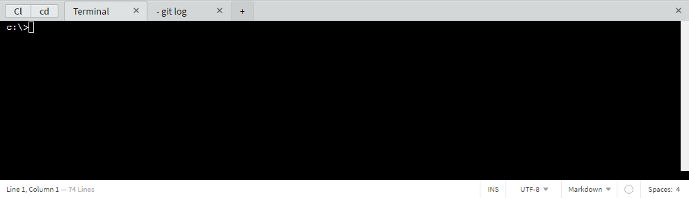

# Brackets Terminal X

Brackets extension to integrate the terminal of your choice.




## Requirements

You need a C++ compiler installed to your computer.


## How to install

### Windows

Since Brackets 1.9 it is possible to install directly from the Extension Manager.
It can take a while to be installed, be patient.

### Other platforms

Download a zip of the extension from GitHub through its "Clone or Download" feature.
After that:
- go to your extension folder [1]
- here extract the zip downloaded before
- `cd brackets-terminal-x-master`
- delete the `.npmrc` file inside the new folder [2]
- run `npm install` [3]
- close and reopen Brackets.

[1] Use `Help \ Show Extensions Folder` or [manually](https://github.com/adobe/brackets/wiki/Extension-Locations#user-extensions-folder)<br />
[2] This file is necessary for Windows build<br />
[3] Make sure to use the same major version of Node.js used for Brackets. Brackets 1.9 uses Node.js 6.<br />


## Report an issue

This extension is based on [xterm](https://github.com/sourcelair/xterm.js).
Before to report an issue you should verify that you cannot reproduce it with the xterm demo.
To run it you should clone their repository and follow their [instructions](https://github.com/sourcelair/xterm.js#demo)


## Preferences

```cson
{
    "brackets-terminal-x.port": 8080,
    // Other examples:
    // - C:\\Windows\\sysnative\\WindowsPowerShell\\v1.0\\powershell.exe
    // - C:\\Program Files\\Git\\bin\\bash.exe
    "brackets-terminal-x.shell.windows": "C:\\Windows\\sysnative\\cmd.exe",
    "brackets-terminal-x.shellArgs.windows": [],
    "brackets-terminal-x.shell.mac": "/bin/bash",
    "brackets-terminal-x.shellArgs.mac": [],
    "brackets-terminal-x.shell.linux": "/bin/bash",
    "brackets-terminal-x.shellArgs.linux": []
}
```

**NOTE:** Brackets preferences do NOT support comments in them.


## Known issues

The height of the scrollbar of the terminal is less than the panel.

If you remove the extension from the Extension Manager more likely it will fail.
At least on Windows there is an executable running so you will need to clean the remaining files by yourself.


## Thanks

This extension is inspired by https://github.com/artoale/brackets-terminal but built with [xterm](http://xtermjs.org) and [node-pty](https://github.com/Tyriar/node-pty)
